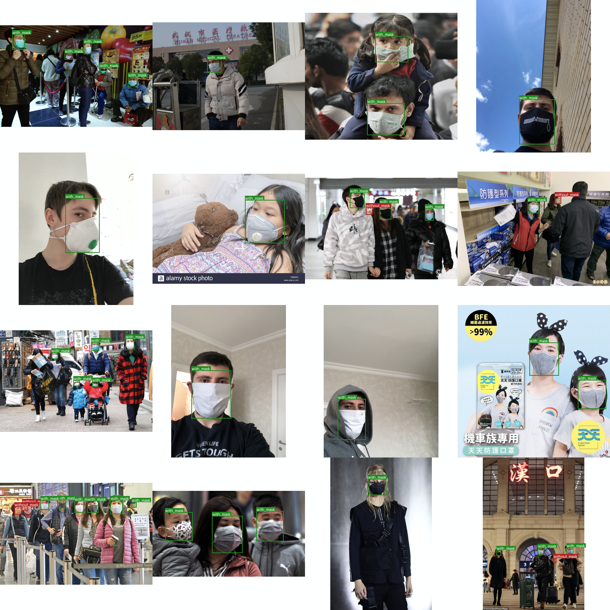
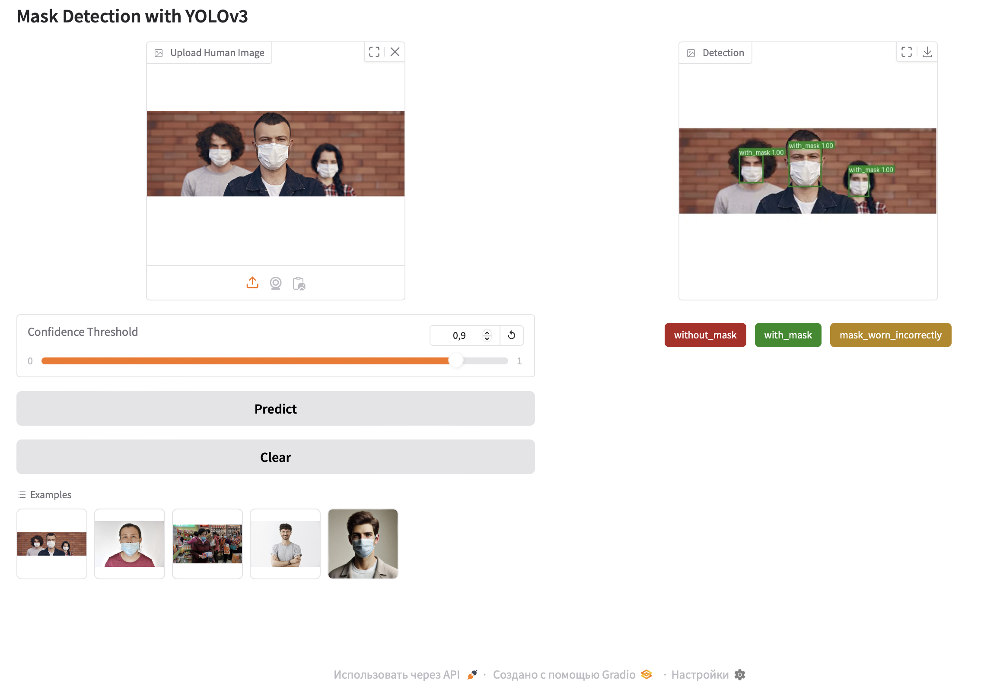
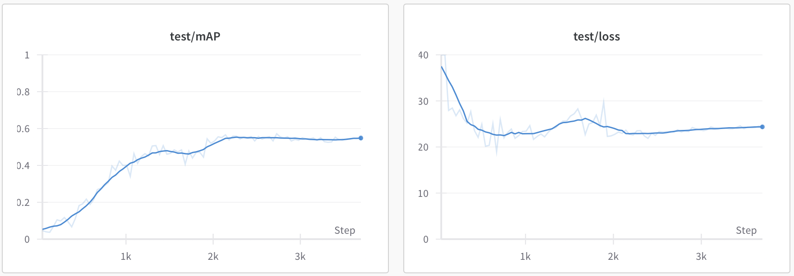
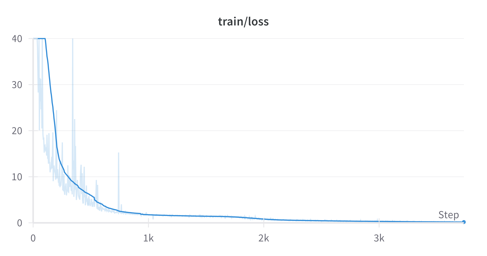

# Mask Detection

## Dataset Samples

Below are sample images from the dataset and their bouding boxes:



This project provides a solution for detecting and classifying faces into 3 categories using YOLOv3 model: without mask, with mask and mask worn incorrectly.

* YOLOv3: Pretrained backbone with three detection heads for multi-scale object detection
  * https://arxiv.org/abs/1804.02767
  * https://github.com/developer0hye/PyTorch-Darknet53

Gradio is used for building a web interface and Weights & Biases for experiments tracking.

Before feeding images into the model, all images are resized with padding to a fixed size of **416x416** pixels.

## Anchor Boxes Calculation

The dataset's anchor boxes were calculated using k-means clustering, resulting in 9 anchor boxes optimized for this dataset. The calculation process is in the `anchor_boxes.ipynb` file.

---

### Anchor Boxes:
| Width  | Height |
|--------|--------|
| 10     | 11     |
| 17     | 19     |
| 26     | 28     |
| 37     | 42     |
| 55     | 59     |
| 78     | 88     |
| 103    | 124    |
| 128    | 152    |
| 182    | 205    |

## Installation

1. Clone the repository:
    ```bash
    git clone https://github.com/your-project/mask-detection.git
    cd mask-detection
    ```

2. Create and activate a virtual environment:
    ```bash
    python -m venv venv
    source venv/bin/activate
    ```

3. Install dependencies:
    ```bash
    pip install -r requirements.txt
    ```
    
4. Download the dataset (for training):
   ```bash
   python data/get_data.py
   ```

## Usage

### Training the Model
   To train the model:
   ```bash
   python src/train.py
   ```

   You can also adjust other parameters, such as the number of epochs, batch size, and learning rate, by adding additional arguments. For example:
   ```bash
   python src/train.py --num-epochs 50 --batch-size 16 --learning-rate 0.0001
   ```

### Launching the Gradio Interface
   ```bash
   PYTHONPATH=src python app.py
   ```

   Once the interface is running, you can select a confidence threshold, upload an image and view the results with detected bounding boxes and their corresponding classes.
   
   

   * Spaces: https://huggingface.co/spaces/eksemyashkina/mask-detection

   * Checkpoints: https://huggingface.co/eksemyashkina/mask-detection

   # Results

| Model  | Train Loss | Test Loss | Test mAP |
|--------|------------|-----------|----------|
| YOLOv3 | 0.34803    | 23.74293  | 0.57185  |

### Training and Test Logs



